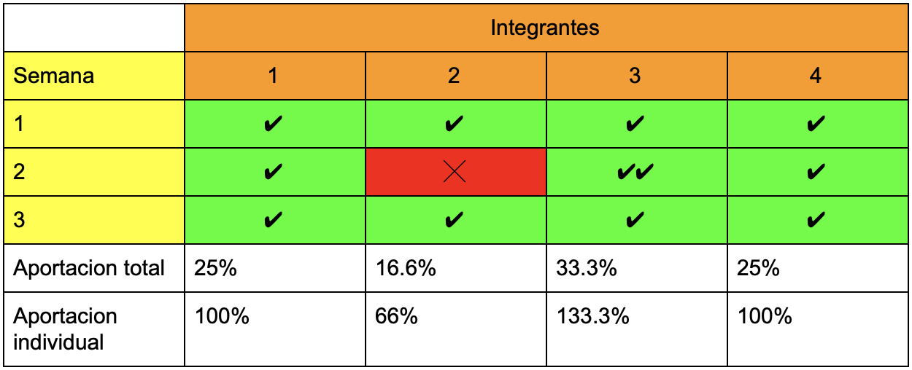

# AIDCA


## ¿Qué es?

AIDCA es un servicio cuyo propósito es mejorar la interacción entre los centros de acopio y los donantes para agilizar la recolecta de los bienes y minimizar el desperdicio de estos.
El servicio cuenta con dos partes (la parte del centro de acopio y la de los donadores), en la primera parte el centro de acopio se registrará en para posteriormente ser verificado; una vez verificado, el centro de acopio podrá utilizar el servicio el cual le mostrará diversas herramientas para la facilitación de la creación de una base de datos personal en donde ingresarán los bienes que necesitan y cuanto necesitan de cada bien. El donador podrá acceder al mismo y ver la informacion de los centros de acopio cercanos a él.

---
## Requisitos

### Funcionales

- *RF001*: El sistema deberá registrar y almacenar en la BDI un correo electrónico (ya sea del encargado o uno especial creado por la organización para el uso del sistema), la contraseña que usará para acceder a la cuenta (que será confirmada reescribiéndola), la ubicación del centro de acopio (calle, cruzamientos, colonia, numero y código postal), el nombre del centro de acopio, del centro de acopio.

- *RF002*: El sistema deberá verificar el correo electrónico proporcionado.

- *RF003*: El sistema esperará una señal del verificador para finalmente confirmar la veracidad del centro de acopio.

- *RF004*: El sistema deberá permitir al encargado acceder al mismo usando el correo electrónico y la contraseña proporcionada.

- *RF005*: El sistema deberá aportarle una herramienta de edición de bases de datos al encargado para que pueda modificar una BDP.

- *RF006*: El sistema deberá proporcionarle herramientas al encargado para la edición del perfil del centro de acopio para ingresar la descripción y el objetivo de este al igual que su horario de atención.

- *RF007*: El sistema deberá proporcionar otra área en donde un donador podrá ver la información de los centros de acopio.

- *RF008*: El sistema le mostrará al donador una lista de los centros de acopio.

- *RF009*: El donador podrá seleccionar un centro de acopio y al hacerlo le mostrará la información de este.


### No funcionales

- *RNF001*: La BDP tendrá una plantilla la cual no podrá ser modificada por los actores.
- *RNF002*: El sistema debe ser accesible únicamente por un navegador de internet.


---

## Pruebas unitarias

Para elaborar pruebas unitarias fácilmente con el lenguaje de programación JavaScript, se usará unit.js el cual es una librería de aserciones las cuales corren en node.js y en el buscador web.

Por ejemplo:

```JavaScript
	var test = require('unit.js');

	describe('Learning by the example', function(){

	  it('example variable', function(){

	    // just for example of tested value
	    var example = 'hello world';
	    test
	      .string(example)
	        .startsWith('hello')
	        .match(/[a-z]/)

	      .given(example = 'you are welcome')
	        .string(example)
	          .endsWith('welcome')
	          .contains('you')

	      .when('"example" becomes an object', function(){

	        example = {
	          message: 'hello world',
	          name: 'Nico',
	          job: 'developper',
	          from: 'France'
	        };
	      })

	      .then('test the "example" object', function(){

	        test
	          .object(example)
	            .hasValue('developper')
	            .hasProperty('name')
	            .hasProperty('from', 'France')
	            .contains({message: 'hello world'})
	        ;
	      })

	      .if(example = 'bad value')
	        .error(function(){
	          example.badMethod();
	        })
	    ;

	  });

	  it('other test case', function(){
	    // other tests ...
	  });

	});
```
---

## Estandares de codificación
### JavaScript

#### Documentos JS
Para utilizar JS se deberá crear un archivo con extensión .js que se vinculara con los distintos archivos HTML que lo necesiten, se deberá crear un archivo distinto para cada funcionalidad que se quiera implementar, intentando seguir el lema de “alta cohesión, bajo acoplamiento”.

Se deberá evitar poner código JS directamente dentro de un documento HTML, a menos que el código que se necesite sea pequeño y solo se vaya a utilizar en ese único documento HTML, si el código es pequeño, pero se utilizara en mas de un archivo HTML entonces ese código se deberá poner en un archivo .js.

#### Documentación automatica
Para la documentación se utilizará la herramienta “ESDoc”, la cual permite generar documentación automática en formato HTML, la herramienta puede encontrarse en el siguiente enlace:
https://esdoc.org/manual/feature.html#documentation-coverage

#### Variables
Las variables deberán tener nombres representativos, evitando nombres como “x”, se deberá utilizar minúsculas a menos que la variable tenga mas de una palabra, en ese caso la segunda palabra iniciará en mayúscula, además las variables preferiblemente deberán ser declaradas utilizando “block scoping”, empleando “let” en lugar de “var”.

```javascript
let opcionEscogida = 2;
```

Las variables siempre deberán inicializarse y cuando se declare varias variables idealmente debe hacerse de la siguiente manera:

```javascript
let opcionEscogida = 2,
    salario = 0,
    numero = 3;
```

Para el nombramiento de constantes se deberá usar la palabra reservada “const”, los nombres de las constantes deberán estar en mayúsculas y si son de mas de una palabra deberán estar separadas por guiones bajos.

```javascript
const MARGIN_TOP = 2;
```

#### Uso de las llaves
Al momento de utilizar if, for, while, funciones, etc. Se deberá de utilizar las llaves de la siguiente forma:

```javascript
  for(let i = 0; i < 10; i++) {
  }
```

La llave de apertura deberá estar en la misma línea que la función y separada por un espacio.

#### Comentarios
(Para los comentarios que no sean de documentación automática) Se deberá evitar el uso de comentarios innecesarios para cosas que sean muy obvias, como por ejemplo “lee una variable”, los comentarios deberán utilizarse cuando el programa no sea tan obvio o cuando haya posibles excepciones o errores.

En la parte superior del archivo JS deberá estar la siguiente estructura de documentación la cual deberá ser llenada de ser posible.

```javascript
  /*
    Entradas: (si aplica)
    Salidas: (si aplica)
    Procedimientos:
  */
```

Para las pruebas se deberá tener comentarios hasta abajo del documento con la siguiente estructura:

```javascript
  /*
    ----------- Pruebas ------------
    Funcion1
    Entradas:
    Salidas:
    Observaciones:

    Funcion2
    Entradas:
    Salidas:
    Observaciones:

  */
```

#### Identación
El código deberá estar indentado con dos espacios a la izquierda.

```javascript
  class App {
    constructor() {
      this.doSomething();
    }

    doSomething() {
      console.log('Oh boy a class!');
    }
  }
```

#### Modularización
Todo el código deberá de modularizarse lo máximo posible, por medio de funciones.

Las funciones en la medida de lo posible deberán nombrarse haciendo uso de “get” y “set”, si el nombre de una función tiene más de una palabra entonces la primera letra de la segunda palabra deberá iniciar en mayúscula, por ejemplo, una función que lea el nombre del usuario idealmente deberá llamarse “setNombre()”.

Una función que únicamente devuelva un valor, sin solicitar ninguna entrada como por ejemplo una función que devuelva el salario de una persona deberá llamarse idealmente: “getSalario()”

```javascript
    function setNombre() {
      let a = prompt("Ingresa tu nombre: ");
      return a;
    }
    function getSalario() {
      return salario;
    }
```

### HTML
#### Generar una plantilla base

Todo documento HTML comenzará con una plantilla base, la cual será generada
automáticamente utilizando el “package” **emmet** en el editor de texto
**atom**.

Dicha platilla se generará creando un nuevo documento HTML y escribiendo:

-   html:5

Posterior a escribir lo anterior se presionará la tecla TAB y se generara la
plantilla, la cual tiene los elementos listados a continuación.

#### Elementos de la plantilla

Para empezar, todos los archivos HTML deberán comenzar con la siguiente
etiqueta:

```html
<!DOCTYPE HTML>
```

Dentro del header la primera etiqueta que deberá incluirse será:

```html
<meta charset="utf-8" />
```

Seguido de las siguientes etiquetas:

```html
<meta name="viewport" content="width=device-width, initial-scale=1.0" />
```

```html
<meta http-equiv="X-UA-Compatible" content="ie=edge"/>
```

#### Etiquetas

Todas las etiquetas HTML deberán estar escritas en minúsculas.

```html
<!-- Correcto -->
<span></span>

<!-- Incorrecto -->
<SPAN></SPAN>
```
Todas las etiquetas deberán tener su etiqueta de cierre correspondiente.

```html
<!-- Correcto -->
<h1>Titulo 1</h1>
<p>Párrafo 1</p>

<!-- Incorrecto -->
<h1>Titulo 1
<p>Párrafo 1
  ```
Las etiquetas que no lleven etiqueta de cierre deberán llevar una “/” al final.

```html
<!-- Correcto -->
<br />
<hr />

<input name="age" type="text" size="3" />

<!-- Incorrecto -->
<br>
<hr>

<input name="age" type="text" size="3">
```
<p style="font-size: 30px; color: #FFFFFF"> Atributos <p>

Los atributos siempre deberán ir escritos en minúsculas.
```html
<!-- Correcto -->
<input name="name" type="text" />

<!-- Incorrecto -->
<input NAME="name" TYPE="text" />
```
Los valores de los atributos de las etiquetas siempre deberán ir entre comillas
(“ ”).
```html
<!-- Correcto -->
<input name="age" type="text" size="3" />

<!-- Incorrecto -->
<input name=age type=text size=3 />
```
#### Identación

Cuando un elemento contenga a uno o más elementos, dichos elementos deberán
indentarse apropiadamente utilizando 2 espacios, ejemplo:
```html
<div class="container">
  <header class="header">
    <h1>Site Name<span></span></h1>
  </header>
  <hr>
  <nav class="navigation">
    <ul>
      <li><a href="#">Link</a></li>
      <li><a href="#">Link</a></li>
      <li><a href="#">Link</a></li>
      <li><a href="#">Link</a></li>
      <li><a href="#">Link</a></li>
    </ul>
  </nav>
</div>
```
#### Comentarios

Deberán ponerse comentarios abajo de la etiqueta de cierre de los elementos HTML
indicando que elemento acaba de terminar, de la siguiente forma:
```html
<ol class="accessibility-nav">
  <li><a href="#navigation">Skip to navigation</a></li>
  <li><a href="#content">Skip to content</a></li>
  <li><a href="#sidebar">Skip to sidebar</a></li>
</ol>
<!-- / Fin barra de navegacion -->

<p>
  <a href="#" title="Go to homepage"><em>Home</em></a>
</p>
<!-- / Fin parrafo -->
```
<p style="font-size: 30px; color: #FFFFFF"> Imagenes <p>

Las imágenes deberán estar dentro de una carpeta llamada img y al llamarlas con
la etiqueta \ debera colocarse la extensión de la imagen. (jpg, png,
etc.).
```html

```
Las imágenes deberán tener el atributo “alt” especificando que imagen es.
```html

```
#### Formularios

Las cajas de texto deberán llevar el atributo “placeholder” indicando que se
debe ingresar.

```html
<input type="text" placeholder="Numero de celular" />
```

Las cajas de texto deberán tener un id y name iguales, el cual deberá ser
representativo.

```html
<input type="text" placeholder="Numero de celular" id="numCelular"
name="numCelular" />
```

Los labels deberán incluir el atributo “for” indicando el id del input al que se
refieren.

```html
<label for="numCelular" >Ingresa tu número de celular: </label>
<input type="text" placeholder="Numero de celular" id="numCelular"
name="numCelular" />
```

#### Titulos

Se debera utilizar las etiquetas h1 – h6 para indicar los títulos que se
necesiten.

```html
<h1>Titulo</h1>
```

### CSS

#### Documentos CSS
Todos los estilos CSS que se utilicen deberán estar en un archivo “style.css”, deberá evitarse colocar estilos dentro de los documentos HTML.

 <p style="font-size: 30px; color: #FFFFFF"> Nombres <p>
Las clases e id deberán ser representativas y si tienen mas de una palabra deberán separarse con “- “, todo deberá estar en minúsculas.

```css
/* Correcto */

.contenedor-articulos

/* Incorrecto */
.contenedor_articulos

.ContenedorArticulos
```

#### Valores

Siempre deberá declararse mas de una fuente en caso de que el navegador no pueda mostrar la primera opción, además cada valor deberá estar separado por un espacio después de la coma.

```css
/* Correcto */
font-family: Arial, Helvetica, sans-serif;

/* Incorrecto */
font-family: Arial;
```
Si se usa cero como valor, no deberá incluirse la medida que se está usando.

```css
/* Correcto */
.nav a {
  padding: 5px 0 5px 2px;
}

/* Incorrecto */
.nav a {
  padding: 5px 0px 5px 2px;
}
```

#### Selectores
	
Los selectores deberán estar separados por un espacio entre si y entre la llave de apertura, además el siguiente selector deberá estar separado por una línea del anterior.

```css
.nav li {
}

.nav a {
}
```

Se deberá evitar el uso de expresiones grandes como la siguiente:

```css
/* Incorrecto */
.my-inbox .flyout-content .inner .message .inbox li div.take-action .actions ul li a {
}
```
Para evitar lo anterior se deberá tener el cuidado de estructurar de la manera mas optima posible el código HTML.

#### Identación

Las propiedades deberán estar indentadas con dos espacios y solo deberá haber una propiedad por línea.

```css
.titulo-header span {
  position: absolute;
  top: 0;
  left: 0;
}
```

#### Comentarios

Deberá usarse el siguiente tipo de comentario para separar las secciones principales.

```css
/* ==========================================================================
   Estilos del header
   ========================================================================== */
```

Deberá tener una línea vacía antes y después, se utilizará para las secciones principales como puede ser el header, la barra de navegación, etc.
Se utilizará el siguiente tipo de comentario para separar subsecciones, como por ejemplo dentro de un contenedor se tiene otro contenedor donde se muestran artículos y hay otro contenedor con una barra de contenidos.

```css
/* Estilos de los artículos
   ========================================================================== */
```

Deberá tener una línea en blanco antes y después.
Si se necesita poner otros comentarios deberán ser de una línea, sin espaciado antes o después.

```css
/* Comentario */
```

---

## Procesos
### Procesos de comunicación

La comunicación se realizará de forma oficial en el canal específico al proyecto en la plataforma de Slack, y de manera informal se utilizará WhatsApp por su mayor accesibilidad. De igual manera se utilizará Discord en caso de ser necesario utilizar servicios de voz o de video llamadas debido a su confiabilidad y por su capacidad para compartir pantallas.

### Procesos de planeación

Para la planeación del proyecto se realizarán juntas semanales entre los integrantes de equipo donde se evaluará el progreso actual y de acuerdo con este se harán los ajustes necesarios para la siguiente evaluación. Pese a esto, el equipo puede ajustarse en caso de algún imprevisto por medio de las plataformas de comunicación previamente mencionadas. Para tener control del progreso individual se utilizará la plataforma de Trello en donde se repartirán las tareas individuales junto con sus fechas de entrega. Al finalizar la junta el equipo resumirá en una bitácora (la cual se encontrará en el repositorio del proyecto) el avance realizado.

Cada semana se dividirá en 3 secciones: 

Asignación: Fechas en las que se fijará que se hará, a quien le toca que, fechas de entrega y pesos de las tareas.
Elaboración: Fechas en las que se elaborará las tareas asignadas.
Corrección: Justo después del ultimo día de elaboración el líder del equipo generará un QA de las tareas asignadas y de ser necesario los desarrolladores corregirán las tareas en las fechas de corrección.


### Procesos de monitoreo

Una vez concluido el proceso de planeación, durante el proceso de construcción se procederá de manera similar cambiando las asignaciones de cada integrante a un enfoque sobre el diseño y codificación de proyecto. Se utilizará Git para el control de versiones y GitHub para alojar el contenido y incorporar los avances de cada integrante. Se continuará evaluando el progreso de manera semanal y haciendo ajustes correspondientemente.

## Metricas
### Avances del proyecto

Para la métrica de el avance general, se establecerá un objetivo semanal a grandes rasgos durante cada junta, los cuales a su vez están conformados por las tareas individuales de cada integrante. De esta forma se pretende tener un avance cuantificable cada semana con fechas límites razonables para que se pueda completar en su totalidad lo que se estableció.

### Metricas individuales

Para la medición de las aportaciones individuales, las actividades tendrán una medida de complejidad del 1 al 3 (1 sencillo, 2 normal, 3 complejo), se decidirá cuales tareas tienen que peso en una junta grupal. Está a criterio del líder del equipo decidir quienes harán que tareas de acuerdo con la experiencia que ha adquirido trabajando con ellos en clase (lo que es también considerado como una tarea. Las tareas solo serán contadas si son terminadas en su totalidad y de manera correcta (el líder del equipo se encargará de hacer el QA de las tareas). De esta forma se facilita medir las aportaciones de cada integrante por medio de una tabla como la siguiente:




En el ejemplo anterior el integrante 2 no cumplio con sus objetivos individuales, por lo que el integrante 3  tuvo que realizarlo en su lugar.

Como podemos observar, cada integrante aporta 25% al proyecto, idealmente, pero en caso de no cumplir con una tarea se ve reflejado tanto en su aportación total al proyecto y la individual, y de esta forma se recompensa también al integrante que cubre una tarea que no le corresponde.

---

## Calendario de actividades

En un archivo tipo Google Docs, llevaremos acabo la elaboración del [calendario](https://docs.google.com/document/d/1k9OYTypTt00hZeMpe8PV4Tt1NRmfRaS5CkBkk8TD_Nk/edit?usp=sharing) de actividades de nuestro proyecto.

---

## Terminos usados

**Encargado**: usuario o usuarios encargados de un centro de acopio.

**Donador**: usuario no encargado de un centro de acopio.

**BDI**: base de datos interna; una base de datos privada que los actores del sistema (donadores y encargados) no pueden acceder.

**BDP**: base de datos personal; una base de datos que puede ser modificada por el encargado de esta.

**Plantilla**: Estructura predefinida
